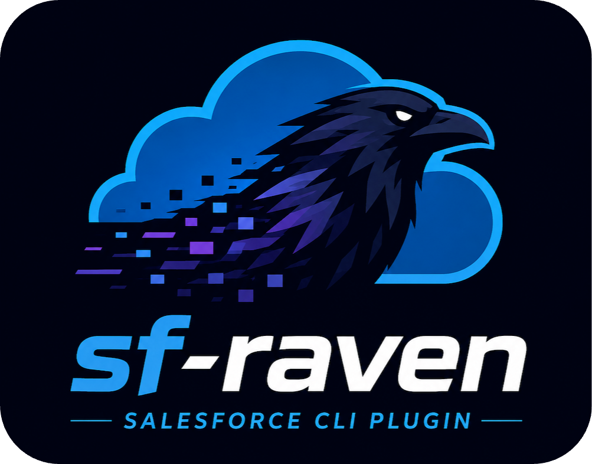

<div align="center">
    
    <br/><br/>
    <b>Salesforce CLI plugin by @tomcarman</b>
    <br/><br/>
  
  [](https://www.npmjs.com/package/sf-raven) [](https://npmjs.org/package/sf-raven) [](https://raw.githubusercontent.com/salesforcecli/sf-raven/main/LICENSE.txt)

</div>

* [Features](#features)
* [Setup](#setup)
* [Command Reference](#command-reference)
  * [sf raven object display fields](#sf-raven-object-display-fields)

</br>

## Features

Full details, usage, examples etc are further down, or can be accessed via `--help` on the commands.

#### sf raven object display

- [sf raven object display fields](#sf-raven-object-display-fields)
  - Show field information for a given sObject.
- [sf raven object display recordtypes](#sf-raven-object-display-recordtypes)
  - Show RecordType information for a given sObject.

#### sf raven audit display

- [sf raven audit display](#sf-raven-audit-display)
  - Show recent entries in the Setup Audit Trail.

#### sf raven event

- [sf raven event subscribe](#sf-raven-event-subscribe)
  - Subscribe to Platform Events, streamed to your terminal.

#### sf raven deploy

- [sf raven deploy cancel](#sf-raven-deploy-cancel)
  - Query an org for pending or in progress Salesforce deployments, and cancel them.

#### sf raven query

- [sf raven query ids](#sf-raven-query-ids)
  - Run a SOQL query against a large list of Salesforce IDs.

#### sf raven pull

- [sf raven pull](#sf-raven-pull)
  - Update Salesforce metadata into the local project via a fuzzy finder.
- [sf raven pull remote](#sf-raven-pull-remote)
  - Retrieve Salesforce metadata that exists in the org but not locally, via a fuzzy finder.

<!-- #### sfdx:raven:utils
* [sfdx raven:utils:deploy:branch2org](#sfdx-ravenutilsdeploybranch2org)
  * Deploy a git branch to an org
* [sfdx raven:utils:diff](#sfdx-ravenutilsdiff)
  * Diff individual metadata items (class, object etc) between orgs
* [sfdx raven:utils:dashboarduser:update](#sfdx-ravenutilsdashboarduserupdate)
  * Change the running user of Dashboards -->

## Setup

### Dependencies
* [fzf](https://github.com/junegunn/fzf) is required for the [sf raven pull](#sf-raven-pull) commands, and should be available on your path. (IMO they are probably the most useful commands in this plugin, so its worth setting up fzf if you don't have it.)

### Quick Install

Assuming you already have the [sf cli](https://developer.salesforce.com/tools/salesforcecli) installed, the plugin can be installed by running:

`sf plugins install sf-raven`

Note: You'll be prompted that this is not officially code-signed by Salesforce - like any custom plugin. You can just accept this when prompted, or alternatively you can [whitelist it](https://developer.salesforce.com/docs/atlas.en-us.sfdx_setup.meta/sfdx_setup/sfdx_setup_allowlist.htm)

### Updating the plugin

The plugin can be updated to the latest version using

`sf plugins update`

### Install from source

1. Install the [SDFX CLI](https://developer.salesforce.com/docs/atlas.en-us.sfdx_setup.meta/sfdx_setup/sfdx_setup_install_cli.htm)
2. Clone the repository: `git clone git@github.com:tomcarman/sf-raven.git`
3. Install npm modules: `npm install`
4. Link the plugin: `sfdx plugins:link .`

### Compatibility

- **macOS**
  - Plugin has been built on macOS and will always run on macOS


## Command Reference

### sf raven object display fields

Show field information for a given sObject.

```
USAGE
  $ sf raven object display fields -o <value> -s <value> [--json] [-c <value>]

FLAGS
  -c, --csv=<value>         Path to write field information as CSV. When supplied, table output is suppressed.
  -o, --target-org=<value>  (required) Login username or alias for the target org.
  -s, --sobject=<value>     (required) The API name of the sObject that you want to view fields for. Use a comma-delimited list to query multiple objects.

GLOBAL FLAGS
  --json  Format output as json.

DESCRIPTION
  Show field information for a given sObject.

  FieldDefinition metadata is queried for the given sObject. The field Labels, API names, and Type are displayed.

EXAMPLES
  $ sf raven object display fields --target-org dev --sobject Account

  $ sf raven object display fields --target-org dev --sobject My_Custom_Object__c

  $ sf raven object display fields --target-org dev --sobject Account,Contact

  $ sf raven object display fields --target-org dev --sobject Account --csv account-fields.csv


OUTPUT

Name               Developer Name  Type
────────────────── ─────────────── ─────────────────
Account Number     AccountNumber   Text(40)
Account Source     AccountSource   Picklist
Annual Revenue     AnnualRevenue   Currency(18, 0)
...
```

### sf raven object display recordtypes

Show RecordType information for a given sObject.

```
USAGE
  $ sf raven object display recordtypes -o <value> -s <value> [--json] [-c <value>]

FLAGS
  -c, --csv=<value>         Path to write Record Type information as CSV. When supplied, table output is suppressed.
  -o, --target-org=<value>  (required) Login username or alias for the target org.
  -s, --sobject=<value>     (required) The API name of the sObject that you want to view Record Types for. Use a comma-delimited list to query multiple objects.

GLOBAL FLAGS
  --json  Format output as json.

DESCRIPTION
  Show RecordType information for a given sObject.

  RecordType metadata is queried for the given sObject. The RecordType Name, DeveloperName, and Id are displayed.

EXAMPLES
  $ sf raven object display recordtypes --target-org dev --sobject Account

  $ sf raven object display recordtypes --target-org dev --sobject My_Custom_Object__c

  $ sf raven object display recordtypes --target-org dev --sobject Account,Opportunity

  $ sf raven object display recordtypes --target-org dev --sobject Account --csv account-record-types.csv


OUTPUT

Name                Developer Name          Id
─────────────────── ─────────────────────── ──────────────────
Business Account    Business_Account        0124J000000XXXXABC
Person Account      PersonAccount           0124J000000YYYYDEF
...
```

### sf raven pull

Update Salesforce metadata into the local project via a fuzzy finder.

```
USAGE
  $ sf raven pull [--json] [-o <value>] [-a]

FLAGS
  -a, --all                 Retrieve all local package directories instead of selecting a path with fzf.
  -o, --target-org=<value>  Login username or alias for the target org. Uses the default org when omitted.

GLOBAL FLAGS
  --json  Format output as json.

DESCRIPTION
  Refresh local Salesforce metadata from an authenticated org. Without --all, local metadata paths are loaded into fzf so you can choose one or more files or directories to retrieve. Press Tab to select multiple paths, then Enter to retrieve them together. With --all, each package directory from sfdx-project.json is retrieved.

EXAMPLES
  $ sf raven pull

  $ sf raven pull --target-org dev

  $ sf raven pull --all

  $ sf raven pull --target-org dev --all
```

### sf raven pull remote

Retrieve Salesforce metadata that exists in the org but not locally, via a fuzzy finder.

```
USAGE
  $ sf raven pull remote [--json] [-o <value>]

FLAGS
  -o, --target-org=<value>  Login username or alias for the target org. Uses the default org when omitted.

GLOBAL FLAGS
  --json  Format output as json.

DESCRIPTION
  List supported metadata components that exist in the target org but are not present in the local project. Org-only components are prefixed with a cloud marker in fzf. Press Tab to select multiple components, then Enter to retrieve them.

EXAMPLES
  $ sf raven pull remote

  $ sf raven pull remote --target-org dev
```

### sf raven deploy cancel

Cancel a pending or in-progress Salesforce deploy.

```
USAGE
  $ sf raven deploy cancel [--json] [-o <value>]

FLAGS
  -o, --target-org=<value>  Login username or alias for the target org. Uses the default org when omitted.

GLOBAL FLAGS
  --json  Format output as json.

DESCRIPTION
  Query the target org for pending or in-progress deploy requests, select one from an interactive list, confirm the cancellation, and submit an asynchronous deploy cancel request.

EXAMPLES
  $ sf raven deploy cancel

  $ sf raven deploy cancel --target-org dev
```

### sf raven query ids

Run a SOQL query against a large list of Salesforce IDs.

```
USAGE
  $ sf raven query ids -f <value> -q <value> [--json] [-o <value>] [-b <value>] [-c <value>] [-l <value>]

FLAGS
  -b, --batch-size=<value>  Number of IDs to include in each query batch. By default, batches are sized to fit Salesforce URI limits.
  -c, --csv=<value>         Path to write query results as CSV. When supplied, table output is suppressed.
  -f, --file=<value>        (required) Path to a file containing one Salesforce ID per row.
  -l, --limit=<value>       Process only the first N unique valid IDs from the file.
  -o, --target-org=<value>  Login username or alias for the target org. Uses the default org when omitted.
  -q, --query=<value>       (required) SOQL query to run. Must include the {ids} placeholder where the ID list should be inserted.

GLOBAL FLAGS
  --json  Format output as json.

DESCRIPTION
  Read Salesforce IDs from a file, deduplicate and validate them, split them into safe query batches, and run a SOQL query with the IDs inserted at the {ids} placeholder.

EXAMPLES
  $ sf raven query ids --file account-ids.txt --query "SELECT Id, Name FROM Account WHERE Id IN {ids}"

  $ sf raven query ids --file account-ids.txt --query "SELECT Id, Name FROM Opportunity WHERE AccountId IN {ids}"

  $ sf raven query ids --file account-ids.txt --query "SELECT Id, Name FROM Account WHERE Id IN {ids}" --limit 25

  $ sf raven query ids --file account-ids.txt --query "SELECT Id, Name FROM Account WHERE Id IN {ids}" --csv results.csv
```

### sf raven audit display

Show recent entries in the Setup Audit Trail.

```
USAGE
  $ sf raven audit display -o <value> [--json] [-u <value>] [-l <value>]

FLAGS
  -l, --limit=<value>       [default: 20] The number of audit trail entries to return. Maximum is 2000.
  -o, --target-org=<value>  (required) Login username or alias for the target org.
  -u, --username=<value>    Username to filter the audit trail by.

GLOBAL FLAGS
  --json  Format output as json.

DESCRIPTION
  Show recent entries in the Setup Audit Trail.

  Returns the 20 most recent Setup Audit Trail entries, but this can be increased up to 2000 using the optional --limit flag. The results can be filtered by a particular user using the --username flag.

EXAMPLES
  $ sf raven audit display --target-org dev

  $ sf raven audit display --target-org dev --limit 200

  $ sf raven audit display --target-org dev --username username@salesforce.com.dev

  $ sf raven audit display --target-org dev --limit 50 --username username@salesforce.com.dev


OUTPUT

Date                Username      Type         Action                                                      Delegate User
─────────────────── ───────────── ──────────── ─────────────────────────────────────────────────────────── ────────────────────
2023-09-29 17:23:47 user@dev.com  Apex Trigger Changed Account Created Trigger code: AccountTrigger        null
2023-09-29 17:23:43 user@dev.com  Apex Trigger Created Account Created Trigger code: AccountCreatedTrigger null
...
```

### sf raven event subscribe

Subscribe to Platform Events, streamed to your terminal.

```
USAGE
  $ sf raven event subscribe -o <value> -e <value> [--json] [-r <value>] [-t <value>]

FLAGS
  -e, --event=<value>       (required) The name of the Platform Event that you want to subscribe with '/event/' prefix eg. /event/My_Event__e.
  -o, --target-org=<value>  (required) Login username or alias for the target org.
  -r, --replayid=<value>    The replay id to replay events from eg. 21980378.
  -t, --timeout=<value>     [default: 3] How long to subscribe for before timing out in minutes eg. 10. Default is 3 minutes.

GLOBAL FLAGS
  --json  Format output as json.

DESCRIPTION
  Subscribe to Platform Events.

  Platform Events are printed to the terminal. An optional flag can be used to relay events from a given relayid. Defaut timeout is 3 minutes, but can be extended to 30 minutes.

EXAMPLES
  $ sf raven event subscribe --target-org dev --event /event/My_Event__e

  $ sf raven event subscribe --target-org dev --event /event/My_Event__e --replayid 21980378

  $ sf raven event subscribe --target-org dev --event /event/My_Event__e --timeout 10

  $ sf raven event subscribe --target-org dev --event /event/My_Event__e --replayid 21980378 --timeout 10


OUTPUT

❯ 🔌 Connecting to org... done
❯ 📡 Listening for events...

{
  "schema": "XdDXhymeO5NOxuhzFpgDJA",
  "payload": {
    "Some_Event_Field__c": "Hello World",
    "CreatedDate": "2021-03-15T19:16:54.929Z",
  },
  "event": {
    "replayId": 21980379
  }
}
```

<!-- ### sfdx raven:utils:deploy:branch2org

Deploys a git branch to an org. Assumes you have git installed the neccessary access to the repo you are trying to clone (eg. you can run `git clone ...`), and that the branch is in a source-format sfdx project structure.

```
USAGE
  $ sfdx raven:utils:deploy:branch2org

OPTIONS
  -u, --targetusername
      (required) sets a username or alias for the target org that you wish to deploy to. overrides the default target org.

  -r, --repository
      (required) URL of the repo. It can either be an HTTPs URL (eg. 'https://github.com/user/some-repo.git') and you
      will be prompted to enter a username and password, or an SSH URL (eg. 'git@github.com:user/some-repo.git')
      which assumes you have SSH keys configured for this repo.

  -b, --branch
      (required) the branch you wish to deploy

  -c, --checkonly
      (optional) Validates the deployed metadata and runs all Apex tests, but prevents the
      deployment from being saved to the org.

  -h, --help
      show CLI help

  --json
      format output as json

  --loglevel              l
      ogging level for this command invocation

EXAMPLE
  $ sfdx raven:utils:deploy:branch2org -r git@github.com:user/some-repo.git -b branchName -u orgName`
  or
  $ sfdx raven:utils:deploy:branch2org -r https://github.com/user/some-repo.git -b branchName -u orgName`


OUTPUT

❯ Cloning repo & checking out 'branchName'... done
❯ Converting from source format to metadata format... done
❯ Initiating deployment... done

❯ The deployment has been requested with id: 0Af4K00000BHVuAXXX

❯ Deployment InProgress (0/31) Processing Type: CustomObject
❯ Deployment InProgress (21/31) Processing Type: CustomTab
❯ Deployment InProgress (30/31) Processing Type: Profile
❯ Deployment Succeeded

❯ Link to deployment page in Salesforce:
https://wise-hawk-22uzds-dev-ed.my.salesforce.com/lightning/setup/DeployStatus/page?address=%2Fchangemgmt%2FmonitorDeploymentsDetails.apexp%3FasyncId%3D0Af4K00000BHVuASAX
```

### sfdx raven:utils:diff

Allows you to quickly compare metadata of files between two orgs. Intended to be used for quick compares of single
(or possibly a few) files of the same metadata type, rather than a full org compare (there are better tools for
that) The results are stored in a diff_{timestamp}.html file wherever you run the command from, and automatically
opened in a browser.

```
USAGE
  $ sfdx raven:utils:diff -s <string> -t <string> -o <string> -i <string> [--filename <string>] [-f <string>]
  [--silent] [--json] [--loglevel trace|debug|info|warn|error|fatal|TRACE|DEBUG|INFO|WARN|ERROR|FATAL]

OPTIONS
  -f, --format=format
      (optional) Format of the diff. Options are 'line' (inline diff) or 'side' (side-by-side diff). Defaults to 'line'

  -i, --items=items
      (required) The items you wish to compare eg. MyCoolClass or Account. Can be multiple items comma delimted eg.
      MyClass,MyController or Account,Opportunity (but can only be of one 'type')

  -o, --type=type
      (required) The type of metadata you want to compare eg. ApexClass or CustomObject

  -s, --source=source
      (required) Alias / Username of the org you want to use as the SOURCE of the diff eg. projectDev

  -t, --target=target
      (required) Alias / Username of the org you want to use as the TARGET of the diff eg. projectQA

  --filename=filename
      (optional) The filename of the diff.html. Defaults to diff_{timestamp}.html

  --json
      format output as json

  --loglevel=(trace|debug|info|warn|error|fatal|TRACE|DEBUG|INFO|WARN|ERROR|FATAL)
      [default: warn] logging level for this command invocation

  --silent
      use this to not auto open browser with results

EXAMPLES
  $ sfdx raven:utils:diff --source dev_org --target qa_org --type CustomObject --items Account
  $ sfdx raven:utils:diff --source dev_org --target qa_org --type CustomObject --items 'Account,Opportunity'
  $ sfdx raven:utils:diff --source dev_org --target qa_org --type ApexClass --items MyClass
  $ sfdx raven:utils:diff --source dev_org --target qa_org --type ApexClass --items 'MyClass,MyTestClass,MyController
  $ sfdx  raven:utils:diff -s dev_org -t qa_org -o CustomObject -i 'Account'
  $ sfdx  raven:utils:diff -s dev_org -t qa_org -o ApexClass -i 'MyClass'
  $ sfdx  raven:utils:diff -s dev_org -t qa_org -o ApexClass -i 'MyClass' --silent

OUTPUT

❯ sfdx raven:utils:diff --source trailhead --target dev --type ApexClass --items 'HelloWorld'
🗂️  Building package.xml... done
⏬ Retrieving from trailhead... done
⏬ Retrieving from dev... done
📂 Unzipping metadata... done
👨‍🍳 Preparing diff... done
✨ Cleaning up... done
🌐 Opening with diff2html in browser... done
```


### sfdx raven:utils:dashboarduser:update

Updates the "Running User" of Dashboards from a given user, to an alternate given user. Useful for mass-updating Dashboards when a user is deactivated.

You will have the following additional options when running -

* A list of Dashboards that will be affected as part of the script will be displayed, with the option to abort if desired.
* The final step to deploy the changes back to the org can be skipped when prompted, allowing for the manual deploy of the patched metadata files - this might be desirable when running against Production environments with strict deployment practices, or if you maintain Dashboard metadata in source control and want to commit the files.

```
USAGE
  $ sfdx raven:utils:dashboarduser:update

OPTIONS
  -u, --targetusername
      (required) sets a username or alias for the target org. overrides the default target org.

  -f, --from
      (required) the username of the user which is currently the 'running user' of the Dashboards eg. 'tom.carman@ecorp.com'

  -t, --to.
      (required) the username of the user which you want to make the new 'running user' of the Dashboards eg. 'james.moriarty@ecorp.com'

  -h, --help
      show CLI help

  --json
      format output as json

  --loglevel
      logging level for this command invocation

EXAMPLE
  $ sfdx raven:utils:dashboarduser:update -u ecorp-dev --from tom.carman@ecorp.com --to james.moriarty@ecorp.com`
``` -->
